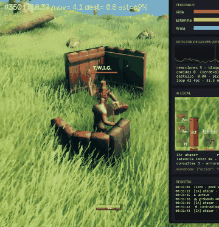
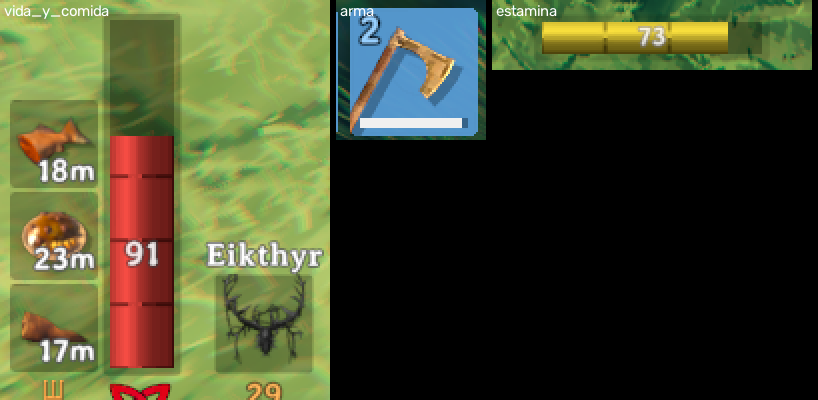

# Bot de entrenamiento Valheim (OpenCV + IA local)

Bot que entrena las habilidades de combate de un personaje de Valheim leyendo solo la pantalla, sin tocar la memoria ni los archivos del juego. Combina dos "cerebros":

- uno **rápido** con visión por computadora clásica (OpenCV) que reacciona en milisegundos a los ataques del enemigo, y
- uno **lento** con un modelo de visión-lenguaje local (Ollama) que mira el HUD cada pocos segundos y decide la estrategia.

Además registra cada decisión en un CSV para comparar qué tan de acuerdo están la IA y un sistema de reglas fijo.

*El bot peleando contra un T.W.I.G.: a la derecha, el panel con las barras leídas, el gráfico del detector de golpes, lo que ve la IA y el registro.*

## Arquitectura

| Archivo | Rol |
|---|---|
| `bot.py` | Punto de entrada. Hilos de combate (60 fps), lectura del HUD, IA y entrada de teclado; estado compartido con lock. |
| `hud.py` | Captura (`mss`) o video, lectura de vida/estamina/durabilidad por píxeles, detector de movimiento y de textos de combate (template matching). |
| `brain.py` | Consulta al modelo local por HTTP con los recortes del HUD, parsea la respuesta JSON y la compara con las reglas. |
| `panel.py` | Panel en Tkinter con barras, gráfico del detector, imagen enviada a la IA, latencias y log. |
| `calibrar.py` / `grabar.py` | Herramientas para calibrar zonas y grabar ejemplos etiquetados a mano (golpe, bloqueo, parry). |
| `config.py` | Todos los umbrales y coordenadas en un solo lugar. |

Stack: Python, OpenCV, NumPy, mss, pydirectinput, pynput, Tkinter, Ollama (moondream / llava-phi3 / qwen2.5vl).

## Qué hace

- **OpenCV (60 fps, ~1 ms por vuelta):** detecta el movimiento del enemigo (sin contar el pasto) y levanta el escudo; cuando ve el destello del bloqueo, contraataca.
- **IA local (Ollama, cada 6 s):** recibe un recorte del HUD más los valores medidos y decide `atacar`, `solo_bloquear` o `comer`.
- **Seguridad:** si la vida baja del 20 %, el bot se pausa y suelta todo, diga lo que diga la IA.
- **Panel Tkinter:** barras, gráfico del detector, lo que ve la IA, latencia, acuerdo entre la IA y las reglas, y el registro.
- **sesion_log.csv:** cada decisión con vida, estamina, arma, IA frente a reglas y latencia, para analizar el experimento.

## Instalación (Windows)
    pip install -r requirements.txt
    ollama pull moondream

## Uso
1. Valheim en **pantalla completa sin bordes, 1920x1080**, la misma escena de siempre.
2. `python calibrar.py` → en 3 s saca una captura. Revisá `calibracion.png`: cada recuadro debe caer sobre su barra.
   Si tenés la vida llena, copiá el número de px en `VIDA_ALTO_LLENO` (config.py).
3. `python bot.py` → arranca **en pausa**. Hacé clic en Valheim y apretá **F8**.
   - F8 pausa/reanuda · F9 alterna IA/reglas · F10 sale
   - Solo manda teclas si la ventana de Valheim está al frente.
4. Prueba sin juego: `python bot.py --video tu_clip.mp4` (no toca el teclado ni el mouse).

## Cómo reconoce los golpes
Lee los textos que muestra el juego alrededor del personaje (`ZONA_TEXTOS`):
- **Bloqueo:** aparece "Blocked: X".
- **Parry:** "Blocked" + la cúpula que aclara la zona (`UMBRAL_CUPULA`).
- **Golpe recibido:** número rojo sin "Blocked".
- **Potenciado:** tu número de daño hasta `ATURDIDO_SEG` después de un parry (sale ~el doble).

Si cambia la escena o el arma: `python grabar.py`, jugá marcando F4 golpe · F6 bloqueo · F7 parry · F8 potenciado (F10 termina) y recalibrá con `etiquetas.mp4`.

## Ajustes útiles (config.py)
- `UMBRAL_MOVIMIENTO`: mirá el gráfico del panel. La línea naranja tiene que quedar arriba del ruido y abajo de los picos de ataque.
- `ESTRATEGIA_BLOQUEO = "mantener"`: escudo siempre arriba, solo sube Blocking (lo más seguro).
- `TECLA_COMIDA`: slot con comida. En tu barra rápida, el 6.
- Si Valheim se traba con la IA cargada: `IA_NUM_GPU = 0` (la IA pasa a la CPU).
- Para comparar modelos: `MODELO_IA = "llava-phi3"` o `"qwen2.5vl:3b"` (más lentos con 3 GB).
